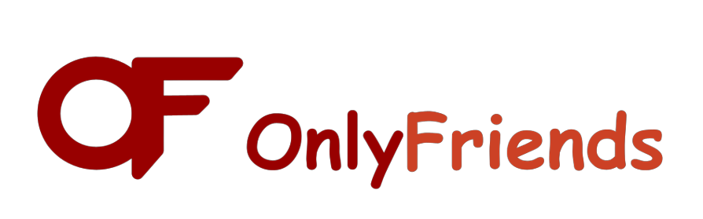

# OnlyFriends
Project for Hack the Valley VII

## Inspiration
Comparing timetables with other students has become tedious, especially when groups get larger. We wanted to create a program to find collective breaks to lessen the complexity of hanging out with your friends, even those out of town. Everyone needs a break to socialize sometimes.

## What it does
The program takes in iCalendar links from different universities and passes it to the backend. The courses are parsed and analyzed to find breaks, and their lengths. After the analysis, the resulting break times are added to the calendar on the home page.

## How we built it
We used HTML and CSS for the frontend and JavaScript for the backend. The HTML buttons allowed for actions to pass through to the JavaScript functions, which then ran our analysis. After the analysis, variables were passed through to the frontend for displaying.

## Challenges we ran into
- We've never coded in HTML, CSS, or JavaScript
- Not all universities have consistent timetable files
- Adding features often broke others
- Formatting the homepage
- Getting variables to work between the languages
- Calendar was limited in capabilities

## Accomplishments that we're proud of
- We made a website that can run code
- The website is formatted nicely
- We were able to integrate most of the features we wanted

## What we learned
- HTML, CSS, and JavaScript
- How to host a website with runnable code

## What's next for OnlyFriends
- Utilizing different APIs to suggest movies, games, and events to do during the breaks
- Add support for more universities
- Potential addition of compatibility with personal events
- Instructions for how to use program

## University Support
- Laurier
- York
- UofT

## Credits
- DEPRECATED Kjell Magne Fauske - Calendar Template - https://codepen.io/kjellmf/pen/qgxyVJ
- FullCalendar LLC - https://fullcalendar.io/

## Known Issues